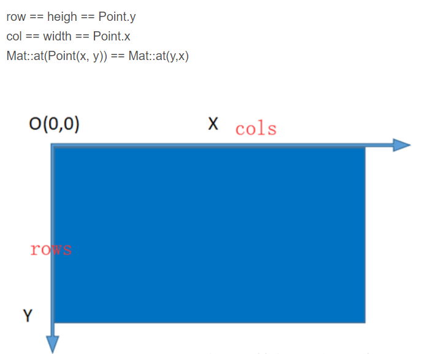

# 3F

### c++重构参考

基本的巡线已在`c++/main.cpp`文件中实现，可以作为参考。编译时，在`c++`目录输入命令`make`，即可将`main.cpp`编译成可执行文件`/bin/opencv_test`。

如果需要更改编译的文件，在`c++/CMakeLists.txt`文件更改相关选项，然后执行`cmake .`命令即可生成对应`Makefile文件`，然后`make`。

#### opencv

opencv的图像对象是`Mat`类型，并且采用引用。

获取对应的像素点值：`(int)canny_img.at<uchar>(y,x)`

可以用`Point2i`表示整型的坐标点，有`x`和`y`属性

如果需要使用数组，可以用`vector`，如：`vector<Point2i> recpointls`

对它的操作采用迭代器`vector<Point2i>::iterator recpointlsP;`，添加`recpointls.push_back(originPoint);`

需要说明图片的宽高和数组的对应关系如下：

如果需要python的相应c++版可以到opencv官网查询相关APIhttps://docs.opencv.org/4.1.1/d9/df8/tutorial_root.html

